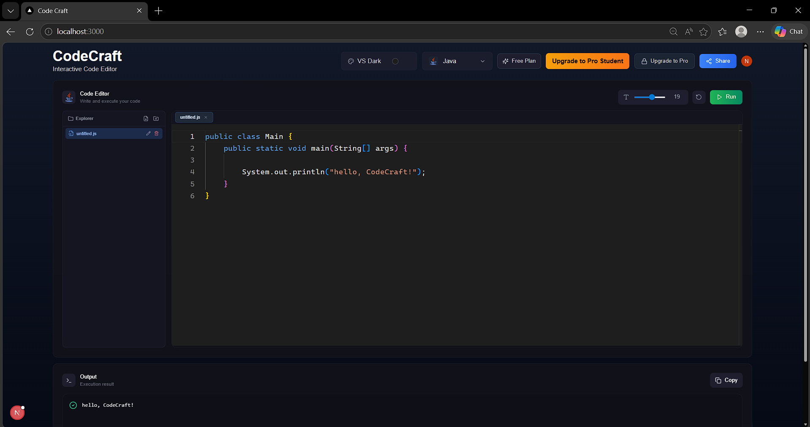
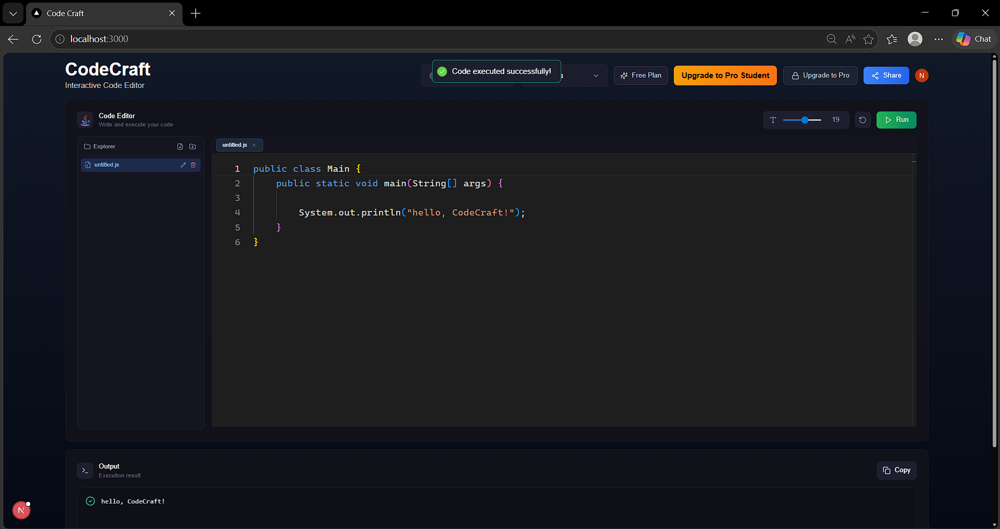
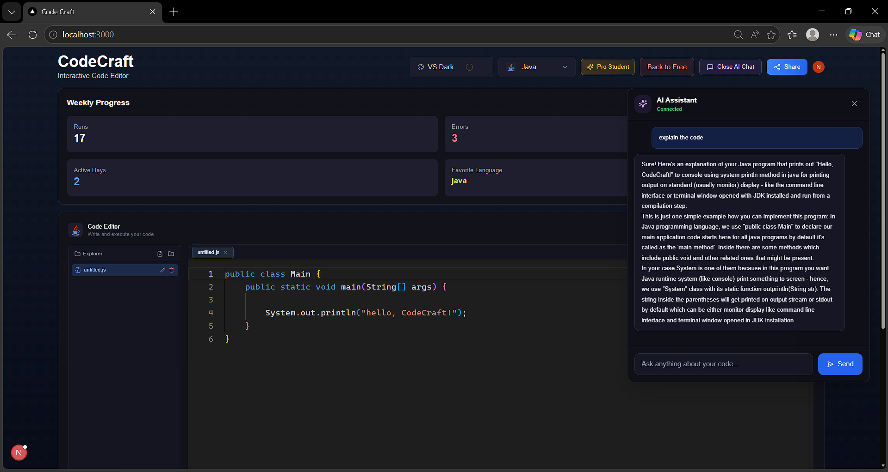
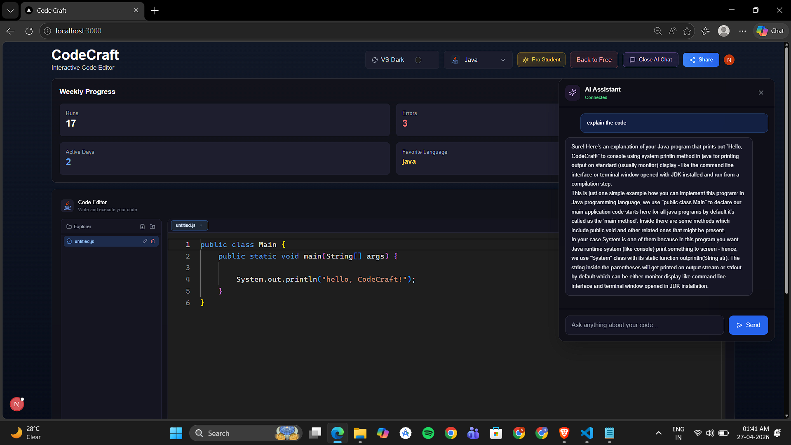

# ✨ CodeCraft - SaaS Code Editor ✨

CodeCraft is a modern, in-browser IDE built with Next.js, offering a seamless coding experience with AI capabilities, real-time features, and a powerful backend.

---

## 🔥 Key Features

* **Advanced Code Editor**
  Monaco Editor (VS Code engine) with themes and font customization.

* **Multi-Language Support**
  Supports JavaScript, TypeScript, Python, Java, and more.

* **AI-Powered Assistant**

  * AI Chat for coding help
  * Explain, Fix, Optimize code
  * AI Autocomplete (Ollama)

* **Virtual File System**
  Create and manage files like a real IDE.

* **Code Snippet Sharing**
  Share and explore code snippets.

* **User Profiles & Stats**
  Track executions, favorite languages, activity.

* **Authentication**
  Secure login using Clerk.

---

## 🛠️ Tech Stack

* Next.js
* React
* TypeScript
* Tailwind CSS
* Zustand
* Monaco Editor
* Clerk
* Convex
* Judge0 API
* Ollama (AI)

---

## ⚙️ How to Run

### 1. Install dependencies

```bash
npm install
```

### 2. Setup environment variables

Create `.env.local`:

```env
NEXT_PUBLIC_CLERK_PUBLISHABLE_KEY=your_key
CLERK_SECRET_KEY=your_key

CONVEX_DEPLOYMENT=your_convex
NEXT_PUBLIC_CONVEX_URL=your_url

JUDGE0_API_URL=https://ce.judge0.com

NEXT_PUBLIC_OLLAMA_ENDPOINT=http://localhost:11434
NEXT_PUBLIC_AI_MODEL=deepseek-coder:1.3b
```

### 3. Run project

```bash
npm run dev
npx convex dev
```

---

## 📸 Screenshots






---

## 📚 Project Modules

### Code Editor

Write and edit code.

### Code Execution

Runs code using Judge0 API.

### AI Assistant

Helps explain, debug, and optimize code.

### Authentication

Handled using Clerk.

### Pro Features

* Weekly progress
* AI access
* Execution history

---

## 🚀 Future Improvements

* Payment integration
* More languages
* AI auto-fix
* Cloud save
* Collaboration

---


